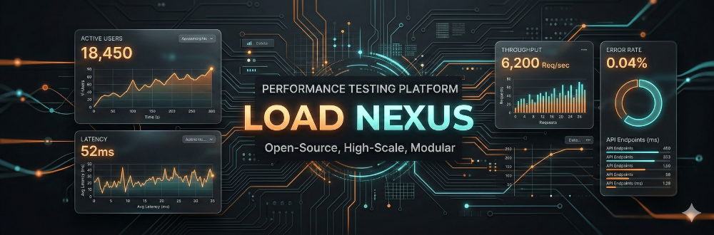
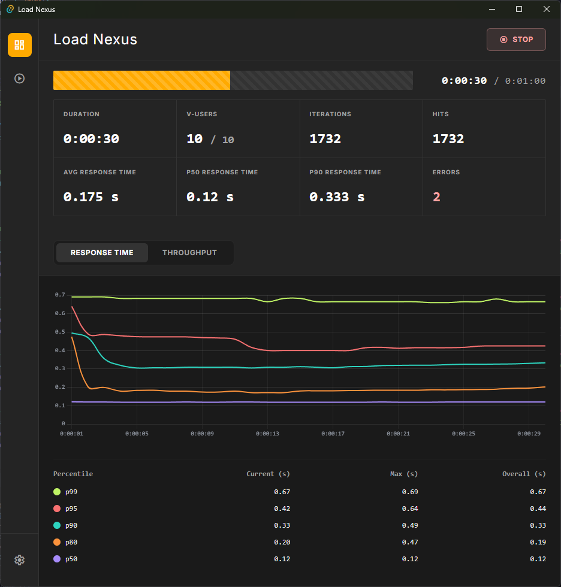
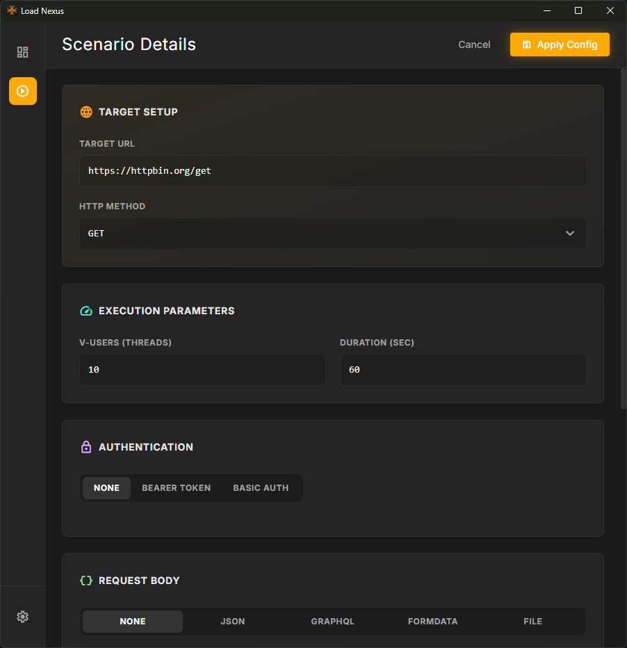

# 🚀 Load Nexus

**Load Nexus** is a high-performance, professional-grade API load testing tool built for modern developers. Combining the safety and speed of **Rust** with the flexibility of a **Tauri-based desktop interface**, Load Nexus provides deep insights into your API's performance under heavy traffic.

## ✨ Features

-   **High Performance Engine**: Powered by Rust's `tokio` and `reqwest`, ensuring minimal overhead and maximum throughput.
-   **Live Dashboard**: Real-time visualization of latency percentiles (P50, P90, P99), RPS, and network throughput.
-   **Comprehensive Analytics**: Track total hits, errors, average response times, and data transfer rates.
-   **Flexible Configuration**: Supports GET, POST, PUT, DELETE methods with custom headers and body data (JSON, GraphQL, Form Data).
-   **File Upload Support**: Seamlessly attach local files as `multipart/form-data` payloads, complete with custom field names and dynamic throughput calculation.
-   **Advanced Authentication**: Seamlessly handle Bearer tokens and Basic Auth.
-   **Visual Excellence**: Modern, glassmorphic UI with dynamic charts and responsive design.

## 📸 Screenshots

| Dashboard Overview | Configuration & Scenarios |
| :---: | :---: |
|  |  |

## 🎯 Use Cases

-   **Stress Testing**: Push your services to their limits to identify breaking points and bottleneck thresholds.
-   **Performance Benchmarking**: Compare different implementations or versions of your API to ensure performance targets are met.
-   **CI/CD Validation**: Run quick load tests locally or in staging environments before deploying to production.
-   **Network Analysis**: Monitor network throughput and data transfer efficiency during high-concurrency scenarios.

## 🛠️ What Makes It Good for Testing?

Load Nexus isn't just another load tester; it's designed for **clarity and speed**:

1.  **Instant Feedback**: Unlike CLI tools that only show results at the end, Load Nexus gives you **live charts** so you can see spikes and performance degradation in real-time.
2.  **Rust Efficiency**: By using a multi-threaded Rust engine, it can simulate thousands of concurrent users with significantly lower CPU and memory usage than Node.js or Python-based alternatives.
3.  **Low Resource Footprint**: As a native desktop app, it stays out of your way while providing a premium experience.
4.  **Actionable Metrics**: Focuses on the metrics that matter—tail latencies (P95/P99) and error rates—rather than just "average" response times.

## 🏗️ Tech Stack

-   **Backend**: Rust, Tauri
-   **Frontend**: React, TailwindCSS, Vite
-   **Charts**: Chart.js
-   **Icons**: Lucide React

## 🚀 Getting Started

1.  Clone the repository:
    ```bash
    git clone https://github.com/your-repo/load-nexus.git
    cd load-nexus
    ```
2.  Install dependencies:
    ```bash
    npm install
    ```
3.  Run in development mode:
    ```bash
    npm run tauri dev
    ```

---

*Load Nexus - Empowering your API performance strategy.*
